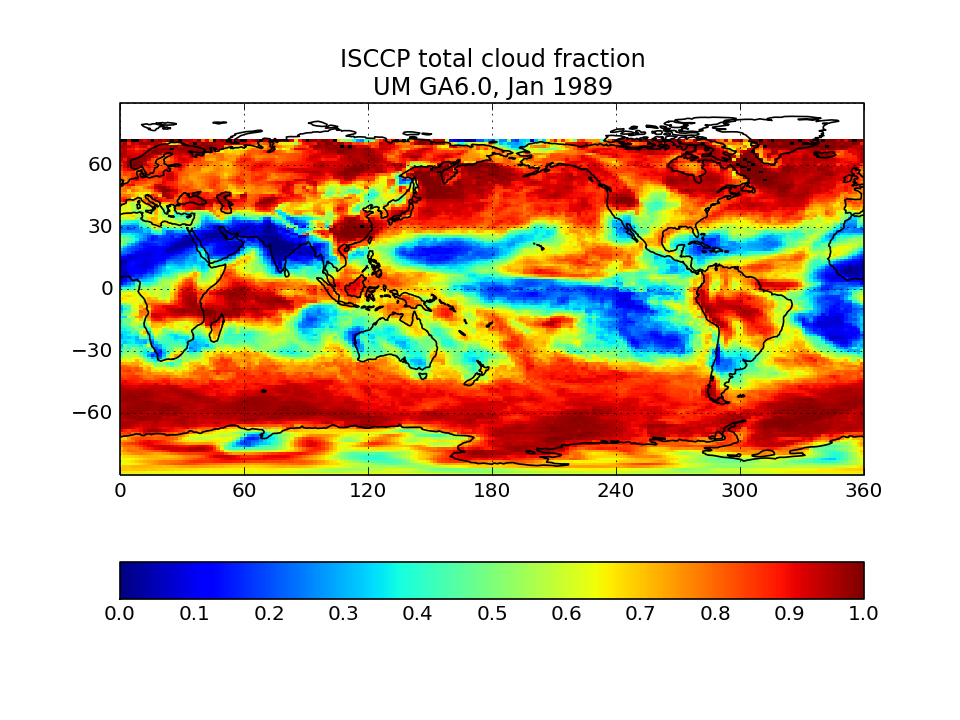

# COSP quicklooks

All figures show monthly means for a single January of a model integration: HadGEM (left) and CAM/ACME (right). Users can contrast similar plots from one of their simulations to confirm that their outputs appear reasonable.

## ISCCP-simulator map of total cloud cover

Calculated from the joint histogram of cloud cover as a function of cloud-top pressure and optical thickness by summing over all pc-tau bins including the bins with tau smaller 0.3 bins. Instead of observations, the quantity is compared to the model's total cloud cover field as computed by the model itself without the use of the ISCCP simulator. This is the field usually called “CLT” in CMIP archives. The comparison plot displays the difference between ISCCP total cloud cover and its model CLT field.  This comparison plot must be made for each model individually.

