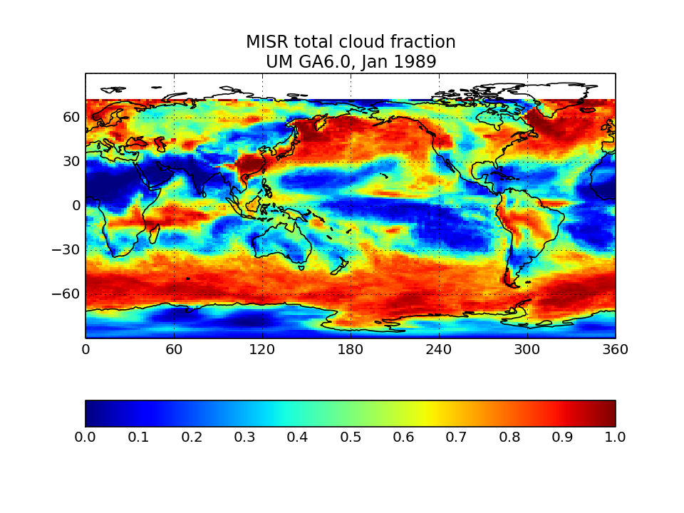

const gitdown = Gitdown(
  '{"gitdown": "variable", "width": "width.value"}'
);

gitdown.setConfig({
  variable: {
    scope: {
      width: {
        value: 200
      }
    }
  }
});

# COSP quicklooks

All figures show monthly means for a single January of a model integration: HadGEM (left) and CAM/ACME (right). Users can contrast similar plots from one of their simulations to confirm that their outputs appear reasonable.

## ISCCP-simulator map of total cloud cover

Calculated from the joint histogram of cloud cover as a function of cloud-top pressure and optical thickness by summing over all pc-tau bins including the bins with tau smaller 0.3 bins. Instead of observations, the quantity is compared to the model's total cloud cover field as computed by the model itself without the use of the ISCCP simulator. This is the field usually called “CLT” in CMIP archives. The comparison plot displays the difference between ISCCP total cloud cover and its model CLT field.  This comparison plot must be made for each model individually.

## ISCCP-simulator globally-averaged pc-tau joint histogram

Global area-weighted average from all points with valid data. Note that per standard practice, only points that are sunlit in the month will have data. Relative to observations, model plots have an extra optical thickness bin for tau less than 0.3.

## CloudSat Simulator global map of cloud volume fraction

Sum fractions over all height and reflectivity bins with reflectivity greater than -25 dBZ and divide by the number of height bins.

## CloudSat Tropical-averaged Contoured Frequency by Altitude Diagram (CFAD)

Area-weighted average from all tropical points. Tropical points are defined as 30S to 30N. Note that model plots will have additional reflectivity bins for dBZ smaller than -25.

## MODIS-simulator global map of total cloud cover

Calculate from the joint histogram of cloud cover as a function of cloud-top pressure and optical thickness by summing over all pc-tau bins with tau greater than 0.3 bins. For the model, the sum should only be for bins with tau greater than 0.3. Observational counterpoint is “Cloud_Fraction_Mask_Total_Mean” in CFMIP-OBS dataset.

## MODIS-simulator globally-averaged pc-tau joint histogram

Global area-weighted average from all points with valid data. Note that per standard practice, only points that are sunlit in the month will have data. Relative to observations, model plots have an extra optical thickness bin for tau less than 0.3.

## MODIS-simulator liquid effective radius

## MODIS-simulator ice effective radius

## MISR-simulator global map of total cloud cover

Calculate from the joint histogram of cloud cover as a function of cloud-top height and optical thickness by summing over all pc-tau bins with tau > 0.3 bins.

## MISR-simulator globally-averaged height-tau joint histogram

Global area-weighted average from all points with valid data. Note that per standard practice, only points that are sunlit in the month will have data. Relative to observations, model plots have an extra optical thickness bin for tau less than 0.3.

## CALIPSO-simulator global map of total cloud cover</a>

## CALIPSO-simulator globally-averaged height-scattering ratio histogram (CFAD)

Global area-weighted average from all points.

